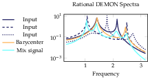

This repository implements all optimal-transport based distances between spectra detailed in the following pre-pre print

[New Metrics Between Rational Spectra and their Connection to Optimal Transport, Bagge Carlson 2019](https://drive.google.com/file/d/1EPS_pyC_opKMLlnk02kIfHbpawWFl4W-/view?usp=sharing)

The package also contains a number of generic solvers for optimal transport problems:
- Fixed support in 1d (histograms)
- Varying discrete support (atoms/dirac masses) with non-uniform masses in any dimension
- Barycenters supported on fixed number of atoms, but possibly with non-uniform masses
- Barycentric coordinates
- Continuous support in 1d

See the [documentation](https://baggepinnen.github.io/SpectralDistances.jl/latest) for instructions.

> Interpolation between two rational spectra under four different metrics.

> Barycenter of three spectra and mixed spectrum which can be decomposed into a combination of the three input spectra
